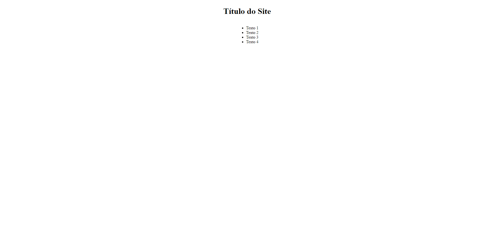
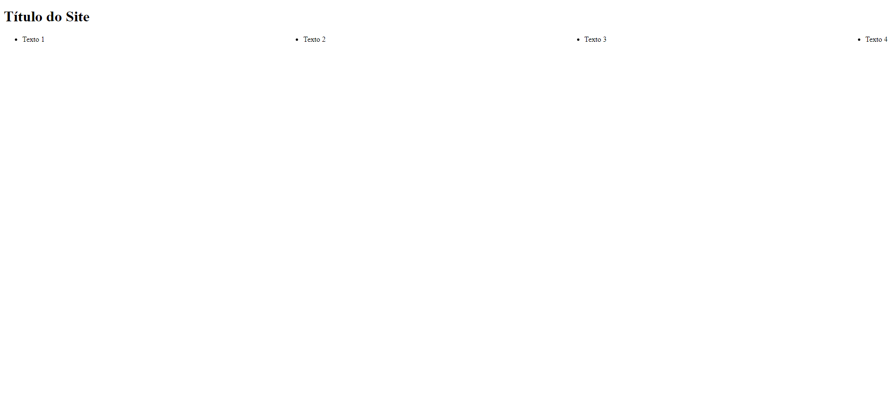

# Frontend: Display Flex

## Vamos por partes...

### O que é um container em programação?

Um container é um elemento HTML usado para agrupar outros elementos e criar uma estrutura lógica para o layout da página. Um container pode ser qualquer elemento que contenha outros elementos dentro dele, ajudando a organizar e estruturar o conteúdo de forma clara e coesa.

Abrir `img`/`imagem2` e `img`/`imagem1`.

#### 1.1. Como identificar um container em HTML

Para identificar se uma tag é um container, faça a seguinte pergunta:  
"Essa tag pode ser 'pai' de outra tag?"

- Se a resposta for **não**, então essa tag não é e nem pode ser um container.
- Se a resposta for **sim**, ela pode ser considerada um container, desde que realmente contenha conteúdo dentro dela.

### O que é um layout em programação?

Um layout em programação refere-se à disposição e organização visual dos elementos em uma interface. É a forma como os diferentes componentes são estruturados e apresentados ao usuário, garantindo que a informação seja clara e acessível.

### O que é um display em programação?

Em HTML e CSS, o display se refere à forma como os elementos de um container são renderizados e organizados no layout da página. Ele controla se um elemento é exibido como um bloco, uma linha, um flex container, entre outros.

### Diferença entre Display, Container e Layout

- **Container** é um elemento estrutural que serve para organizar e agrupar outros elementos HTML. Ele age como um recipiente para conteúdo, ajudando a criar uma estrutura lógica e organizada para a página.

- **Layout** refere-se à disposição e organização visual dos elementos em uma interface. É a forma como os diferentes componentes são estruturados e apresentados ao usuário, garantindo que a informação seja clara e acessível. O layout pode ser afetado tanto por containers quanto por suas propriedades de display, pois determina como os elementos se relacionam e se organizam no espaço da página.

- **Display** refere-se à propriedade CSS que controla como um elemento é exibido e como ele se comporta visualmente no layout da página. É responsável por determinar se o elemento é tratado como um bloco, uma linha, um flex container, ou até se não é exibido.

Um ponto importante é que, embora todo container possa ter uma propriedade de display definida, nem todo display é necessariamente um container. O display controla a apresentação, enquanto o container é sobre agrupar e organizar conteúdo.

> **Nota:** É de extrema importância distinguir display, container e layout, porque quando nos referimos a `display: flex`, estamos usando a propriedade display para editar o layout de um container!

### Resumindo tudo:

Todo `container` possui um layout que pode ser ajustado de maneira significativa utilizando a propriedade `display`.

### Edição ou estilização de containers

A edição ou estilização de containers é feita usando CSS. Para modificar o layout de um container, você utiliza a propriedade display, que pode ser definida como flex para aplicar o modelo de layout flexível. Isso permite que você organize e manipule os elementos internos de forma mais eficiente.

#### 2.1. Display: flex

Quando você define um contêiner (um elemento que contém outros elementos) como `display: flex`, ele se torna um "contêiner flexível". Isso significa que todos os elementos dentro deste contêiner (chamados de "itens flex") vão se comportar de uma maneira especial, tornando a organização do layout mais fácil e dinâmica.

### Como usar `display: flex`

Para estilizar os elementos internos, aplique `display: flex` na tag container. Como o container abriga os elementos que você deseja editar, ele é o único que pode controlá-los diretamente e manipular seu layout.

#### Exemplo de HTML

```html
<body>
  <header>
    <h1>Título do Site</h1>
    <ul>
      <li>Texto 1</li>
      <li>Texto 2</li>
      <li>Texto 3</li>
      <li>Texto 4</li>
    </ul>
  </header>
</body>
```
Se eu quiser centralizar a tag `h1` e a lista `ul` no centro do site, devo aplicar a propriedade `display: flex` na tag `header`, que é a tag pai desses dois elementos:

#### Exemplo de CSS

```css
header {
    display: flex;
    justify-content: center;
    align-items: center;
    flex-direction: column;
}
```
Ficando assim:



mas caso queira manipular somente os itens da lista “ul” faço da seguinte forma:

#### Exemplo de CSS

```css
ul {
    display: flex;
    justify-content: space-between;
    align-items: center;
}
```

Ficando assim:



#### 2.3. Como é a organização do display flex?

Essa organização é baseada em linhas e colunas, que podem ser posicionadas de diferentes formas:

**Linhas e Colunas:** Por padrão, os itens flex são organizados em uma linha, da esquerda para a direita. No entanto, você pode alterá-los para serem organizados em uma coluna, de cima para baixo, usando a propriedade `flex-direction`:

```css
/* Linha (padrão): */
display: flex;

/* Colunas: */
display: flex;
flex-direction: column;
```
### Organização de Itens com `justify-content` e `align-items`

Essas linhas e colunas têm dois comandos principais que, como já disse o professor Matheus, "sempre andam juntos":

## Comandos Principais do Flexbox

- **`justify-content:`** é usado para alinhar itens em uma linha (horizontalmente). Ele ajuda a decidir se os itens ficam juntos no centro, separados, ou alinhados à esquerda ou à direita. Imagine organizar coisas em uma prateleira: você escolhe como elas ficam distribuídas.
  - `flex-start`: alinha os itens ao início do contêiner.
  - `flex-end`: alinha os itens ao final do contêiner.
  - `center`: centraliza os itens.
  - `space-between`: coloca o maior espaço possível entre os itens.
  - `space-around`: coloca espaços iguais ao redor de cada item.

- **`flex-direction:`** define a direção em que os itens flexíveis são dispostos no contêiner. Você pode escolher entre organizar os itens em linhas ou colunas.
  - `row`: organiza os itens em uma linha (horizontalmente), que é o padrão.
  - `row-reverse`: organiza os itens em uma linha, mas na direção oposta.
  - `column`: organiza os itens em uma coluna (verticalmente).
  - `column-reverse`: organiza os itens em uma coluna, mas na direção oposta.

    > - **Detalhando mais flex-direction:** A propriedade **`flex-direction`** determina como os itens são organizados em um contêiner flexível. Você pode escolher entre linhas (horizontal) ou colunas (vertical). Isso afeta a disposição dos itens, bem como os eixos principal e cruzado.
    >
    >   - **Eixos Principal e Cruzado**
    >     - **Eixo Principal**: A direção dos itens (horizontal ou vertical) definida pela `flex-direction`.
    >     - **Eixo Cruzado**: Perpendicular ao eixo principal (se o eixo principal for horizontal, o eixo cruzado será vertical, e vice-versa).

  Abrir `img`/`imagem3 e 4`.

- **`align-itans:`** A propriedade **`align-items:`** é usada no Flexbox para alinhar itens ao longo do **eixo cruzado**, que pode ser vertical ou horizontal, dependendo da direção do eixo principal. Quando o contêiner flexível usa a direção padrão (`flex-direction: row`), o eixo cruzado é vertical. Se a direção for alterada para `flex-direction: column`, o eixo cruzado se torna horizontal. Essa propriedade decide como os itens são distribuídos no eixo cruzado, seja no topo, centro ou parte inferior.

Imagine uma caixa de ovos que pode ser posicionada em pé (eixo cruzado vertical) ou deitada (eixo cruzado horizontal). O `align-items` define se os ovos vão ficar encostados no topo, no meio ou na parte inferior, dependendo de como a caixa é orientada.

- **`flex-start`**: alinha os itens no início do eixo cruzado (no topo para eixo vertical, à esquerda para eixo horizontal).
- **`flex-end`**: alinha os itens no final do eixo cruzado (parte inferior para eixo vertical, à direita para eixo horizontal).
- **`center`**: centraliza os itens ao longo do eixo cruzado, seja vertical ou horizontal.
- **`stretch`**: faz com que os itens ocupem todo o espaço disponível ao longo do eixo cruzado, esticando-os para preencher o contêiner.

Assim, o `align-items` ajusta o alinhamento no eixo oposto à direção principal dos itens no Flexbox, seja ele vertical ou horizontal.

- **`flex-wrap:`** controla se os itens devem quebrar para uma nova linha ou coluna se não houver espaço suficiente.
  - `nowrap`: os itens não quebram e ficam em uma única linha (padrão).
  - `wrap`: os itens quebram e formam novas linhas.
  - `wrap-reverse`: os itens quebram, mas na direção oposta.

- **`flex-grow:`** permite que um item flexível cresça para ocupar o espaço extra no contêiner. É um número que determina quanto espaço um item deve ocupar em relação aos outros itens.
  - Um valor de `1` significa que o item pode crescer para ocupar o espaço extra.
  - Um valor de `0` significa que o item não crescerá.

- **`flex-shrink:`** controla como os itens devem encolher se o espaço for insuficiente. É útil para evitar que os itens ultrapassem os limites do contêiner.
  - Um valor de `1` significa que o item pode encolher se necessário.
  - Um valor de `0` significa que o item não encolherá.

- **`flex-basis:`** define o tamanho inicial do item antes que o espaço extra seja distribuído. Ele pode ser definido em pixels, porcentagens, etc.
  - Por exemplo, `flex-basis: 100px;` define que o item deve ter 100 pixels de largura antes de crescer ou encolher.

> Abrir `Sitescomandos`/`Abrir todos os arquivos`/`Abrir liveserver de cada index`.
